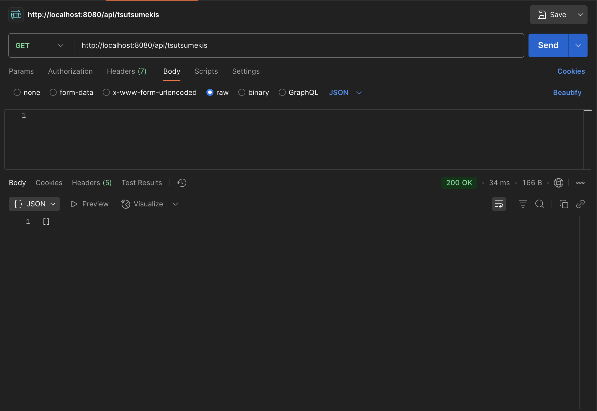

# 結合テスト仕様書
## 実施項目
| No   | メソッド | テスト処理 | 前提条件 | 操作手順 | 期待結果 | 実施結果 |
| --- | ----------- | ------- | ------- | ------- | ------- | ------- |
| 2 | GET | 正常ケース | DBにインポートできるデータが存在しない | APIとDBを立ち上げPostmanにてGETリクエストとしてhttp://localhost:8080/api/tsutsumekisを送る | 空のデータがjson形式で返されること |OK|

## テストデータ
| id   | tsutsumeki |
| --- | ----------- |
## テスト実施
### DB立ち上げ
```
docker comopose up -d
```
### API立ち上げ
```
./mvnw spring-boot:run // macOs
```

### 実施結果
