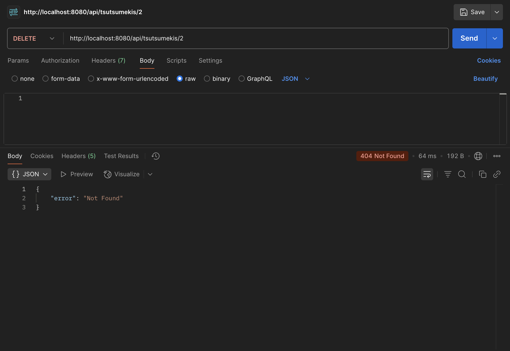

# 結合テスト仕様書
## 実施項目
| No   | メソッド | テスト処理 | 前提条件 | 操作手順 | 期待結果 | 実施結果 |
| --- | ----------- | ------- | ------- | ------- | ------- | ------- |
| 8 | DELETE | 異常ケース | APIとDBを立ち上げており、データ内に該当するIDが存在しない | PostmanにてDELETEリクエストとしてhttp://localhost:8080/api/tsutsumekis/{id}に適当なテキストを送る | データの削除が行われず"Not Found"がjson形式で返されること |OK|

## テストデータ
| id   | tsutsumeki |
| --- | ----------- |
| 1 | '六段の調べやりたい人いない？' |
| 3 | '○市でもくもく会やってませんか？' |
| 4 | '新しいツツメキ' |
## テスト実施
### DB立ち上げ
```
docker comopose up -d
```
### API立ち上げ
```
./mvnw spring-boot:run // macOs
```

### 実施結果
http://localhost:8080/api/tsutsumekis/2にて実施
