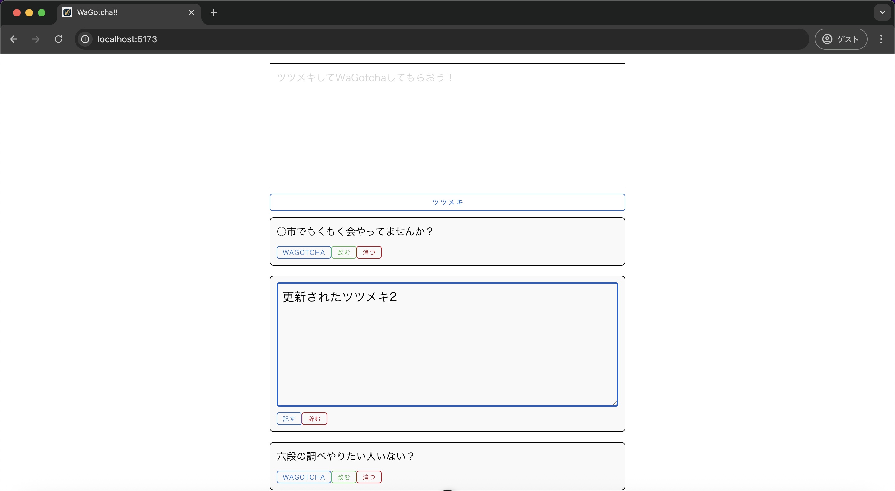
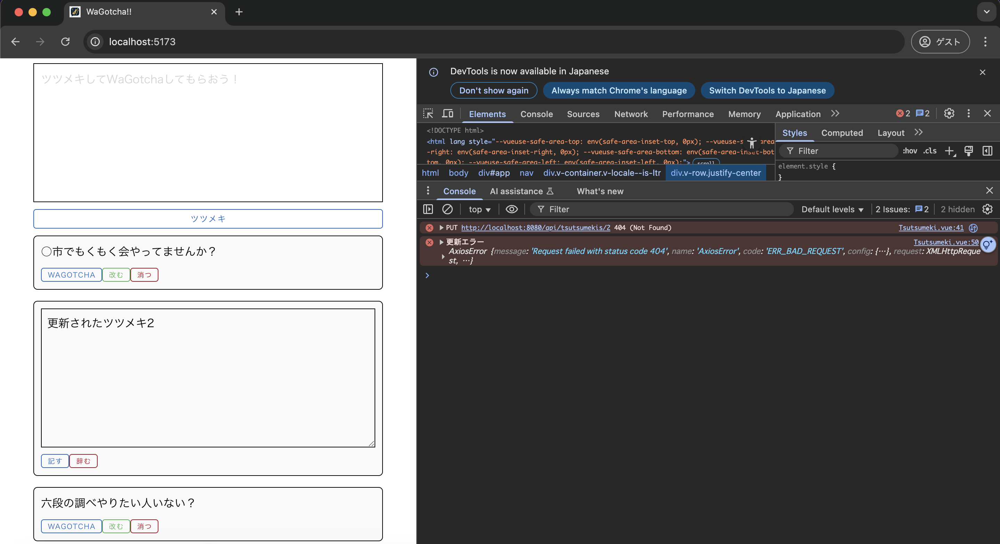

# 結合テスト仕様書
## 実施項目
| No   | 画面 | テスト処理 | 前提条件 | 操作手順 | 期待結果 | 実施結果 |
| --- | ----------- | ------- | ------- | ------- | ------- | ------- |
| 7 | 一覧画面 | PUT | DBにインポートできるデータがある状態でDB,Vue,Springを立ち上げlocalhost:5173を表示している | 改むボタンを押下後にDBから該当するデータを削除し、そのテキストを書き換え記すボタンを押下 | 検証画面にてエラーのレスポンスが表示されること |OK|
## テストデータ
| id   | tsutsumeki |
| --- | ----------- |
| 1 | '六段の調べやりたい人いない？' |
| 2 | '来週演奏会やります！' |
| 3 | '○市でもくもく会やってませんか？' |
## テスト実施
### DB立ち上げ
```
docker comopose up -d
```
### Vue立ち上げ
```
npm run dev
```
### Spring立ち上げ
```
./mvnw spring-boot:run // macOs
```
### 下記の行を削除
| id   | tsutsumeki |
| --- | ----------- |
| 2 | '来週演奏会やります！' |
### 改むボタンを押下しテキスト書き換え

## 実施結果
### 記すボタン押下後
エラーレスポンスが404 Not Foundと合致

### テストデータ
| id   | tsutsumeki |
| --- | ----------- |
| 1 | '六段の調べやりたい人いない？' |
| 3 | '○市でもくもく会やってませんか？' |