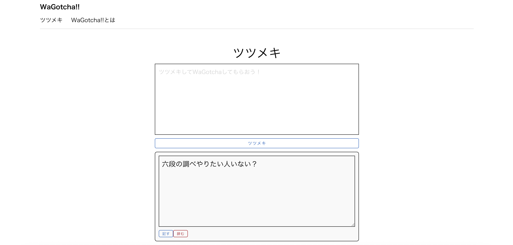

# 画面設計書
## はじめに
和楽知屋 -WaGotcha-はSPAの形式を取っており、「和楽知屋」の下にある一覧の名前を押下することでそれぞれに該当するページに切り替わります。

本画面設計書では、各ページ毎に概要や機能の説明をしていきます。

## ツツメキ

本アプリの根幹となる文章のCRUD画面となります。

テキストボックスに文章を書き、下のツツメキボタンを押下することでテキストボックスに書かれた内容が下のタイムラインの上に表示されます。

ツツメキボタンの下にはこれまでの投稿が表示されており、それぞれに対しWaGotcha、改む、消つというボタンも表示します。

WaGotchaボタンはXでいういいね機能、改むは既に投稿したツツメキの編集、消つは削除機能となります。

改むボタンを押下すると上記画像のような表示となります。

ここで記すボタンを押下するとツツメキの更新が行われ、辞むボタンを押下すると更新されず元の表示に戻ります。

【追記】

上記の画面構成で実装やテストを実施した後、初回デプロイに向けた準備の段階でUIを下記のように変更しました。

変更内容は色やフォントといった非機能要件でレイアウトや具体的な機能には直接関係がないのでテストの再実施は省略しています。

## WaGotcha!!とは

本アプリの趣旨を説明した画面となります。

【追記】

上記の画面構成で実装やテストを実施した後、初回デプロイに向けた準備の段階でUIを下記のように変更しました。

変更内容は色やフォントといった非機能要件でレイアウトや具体的な機能には直接関係がないのでテストの再実施は省略しています。

## その他
以上のUIや説明の文章は今後の実装に応じて随時更新予定です。