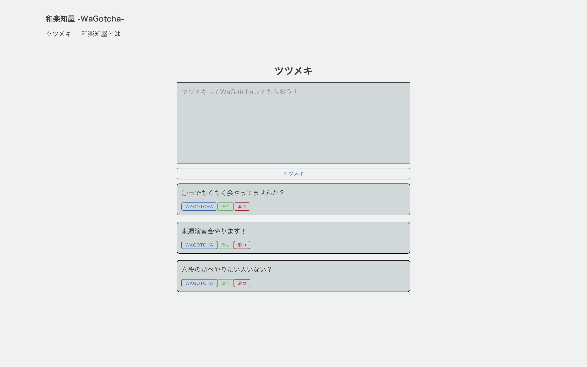
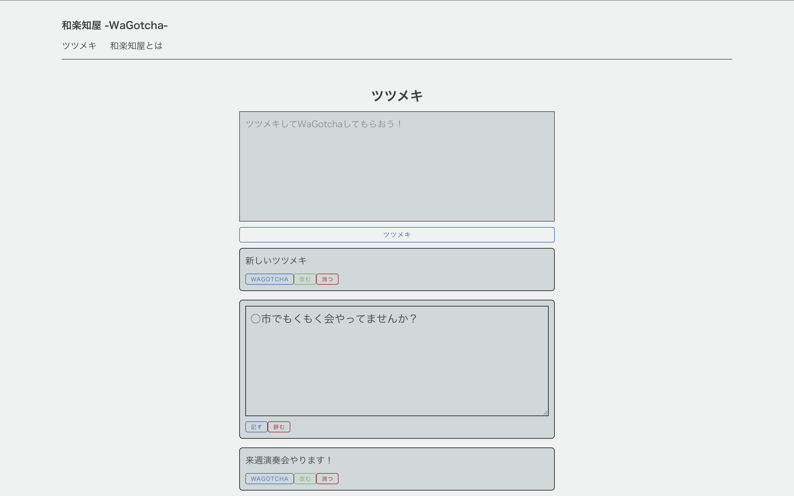
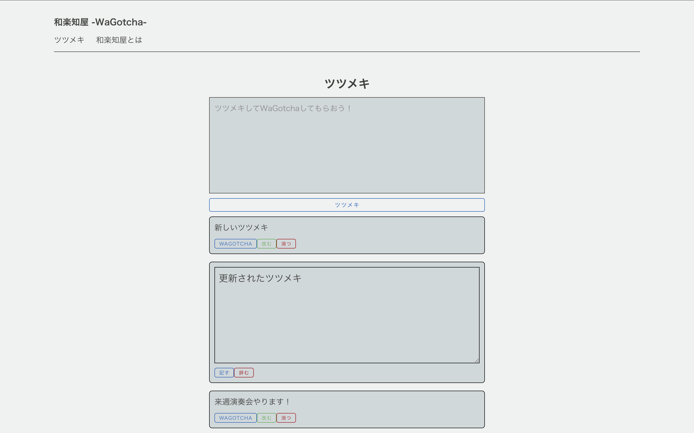
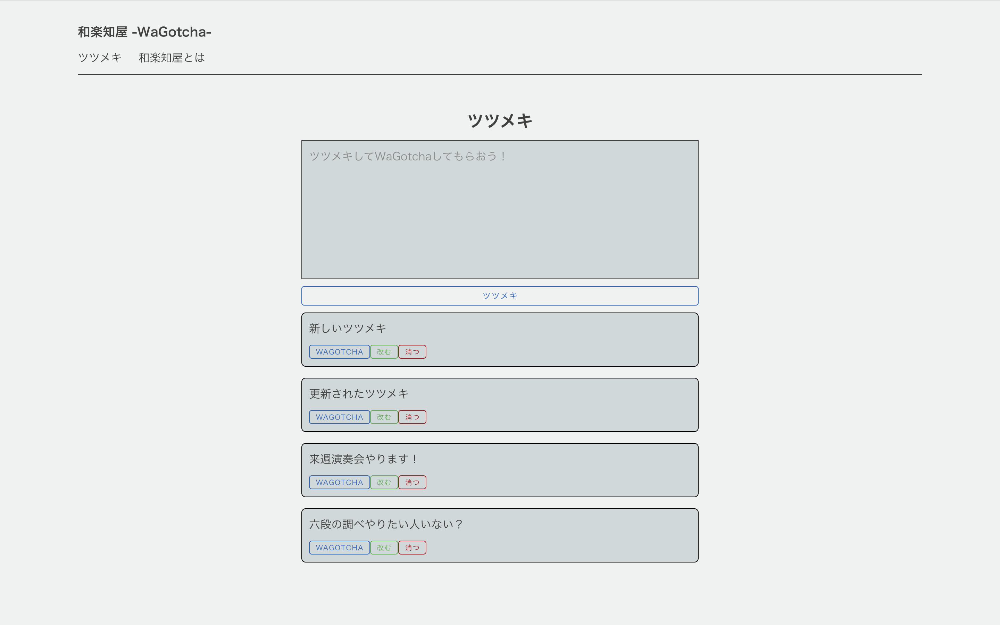
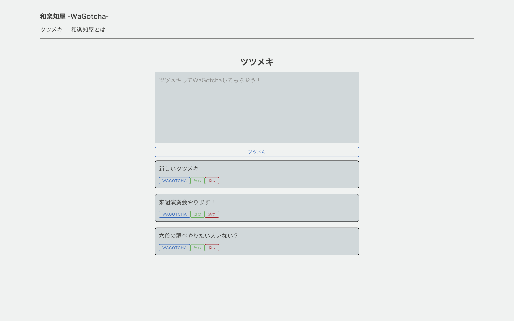

# 第1回デプロイシステムテスト実施結果
1. 画面が表示され、DBに登録されたデータが反映されていること

| id   | tsutsumeki |
| --- | ----------- |
| 1 | '六段の調べやりたい人いない？' |
| 2 | '来週演奏会やります！' |
| 3 | '○市でもくもく会やってませんか？' |

2. 入力枠に任意の文字列を入力

3. ツツメキボタンを押下し投稿として新たに画面へ反映される

| id   | tsutsumeki |
| --- | ----------- |
| 1 | '六段の調べやりたい人いない？' |
| 2 | '来週演奏会やります！' |
| 3 | '○市でもくもく会やってませんか？' |
| 4	|新しいツツメキ |

4. 改むボタンを押下

5. 任意の文字を入力

6. 記すボタンを押下

| id   | tsutsumeki |
| --- | ----------- |
| 1 | '六段の調べやりたい人いない？' |
| 2 | '来週演奏会やります！' |
| 4	|新しいツツメキ |
| 3 | 更新されたツツメキ |

7. 消つボタンを押下

| id   | tsutsumeki |
| --- | ----------- |
| 1 | '六段の調べやりたい人いない？' |
| 4	|新しいツツメキ |
| 3 | 更新されたツツメキ |