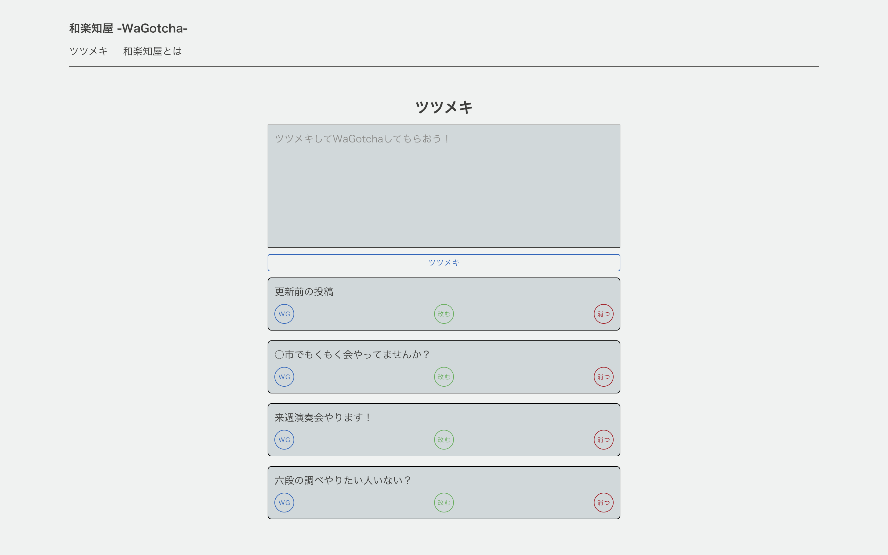
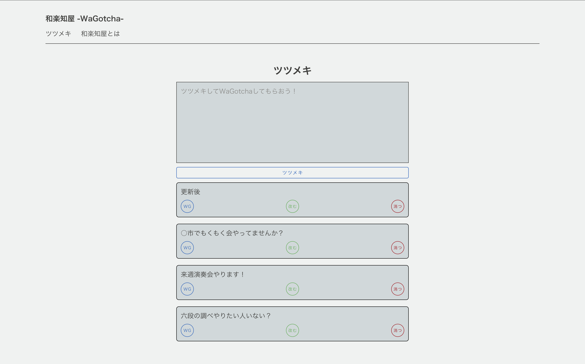
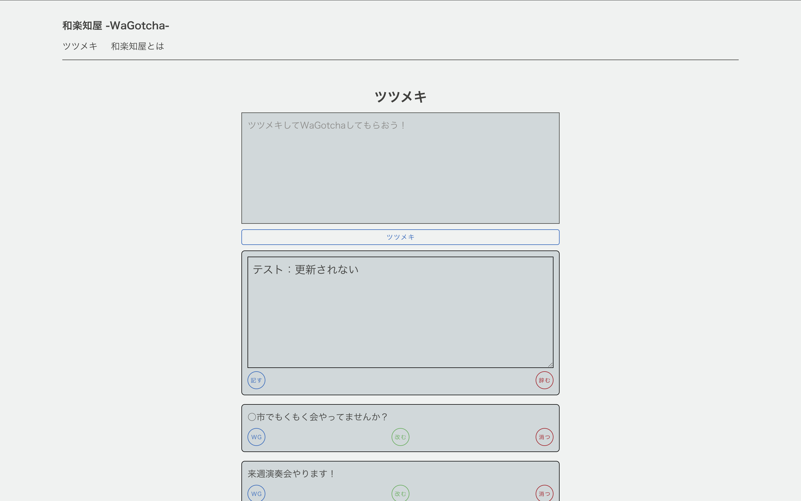

# 第2回デプロイシステムテスト実施結果
1. 画面が表示され、DBに登録されたデータが反映されていること

| id   | tsutsumeki |
| --- | ----------- |
| 1 | '六段の調べやりたい人いない？' |
| 2 | '来週演奏会やります！' |
| 3 | '○市でもくもく会やってませんか？' |
| 4	|'更新前の投稿' |

2. 改むボタンを押下、表に該当する行の投稿内容を書き換え

| id   | tsutsumeki |
| --- | ----------- |
| 4	|'更新前の投稿' |

3. 記すボタンを押下

| id   | tsutsumeki |
| --- | ----------- |
| 1 | '六段の調べやりたい人いない？' |
| 2 | '来週演奏会やります！' |
| 3 | '○市でもくもく会やってませんか？' |
| 4	|'更新後' |

4. 再び改むボタンを押下し、任意のテキストを入力

| id   | tsutsumeki |
| --- | ----------- |
| 4	|'更新後' |

5. 辞むボタンを押下

| id   | tsutsumeki |
| --- | ----------- |
| 1 | '六段の調べやりたい人いない？' |
| 2 | '来週演奏会やります！' |
| 3 | '○市でもくもく会やってませんか？' |
| 4	|'更新後' |