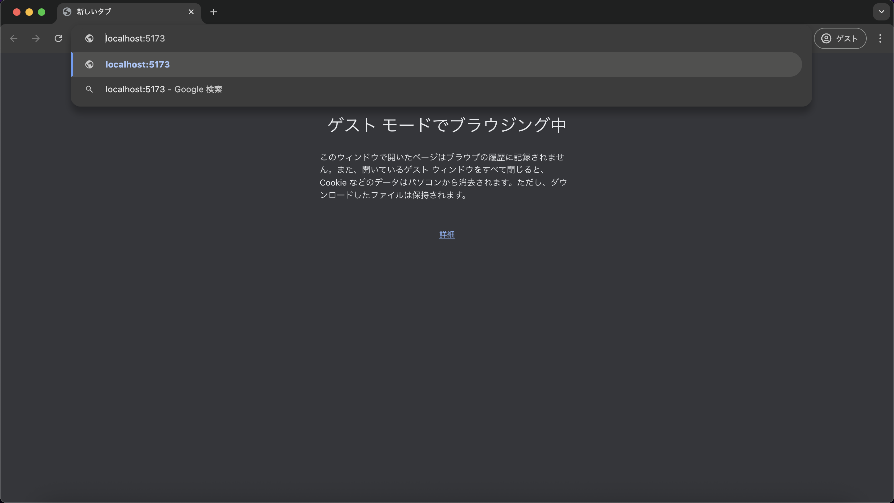
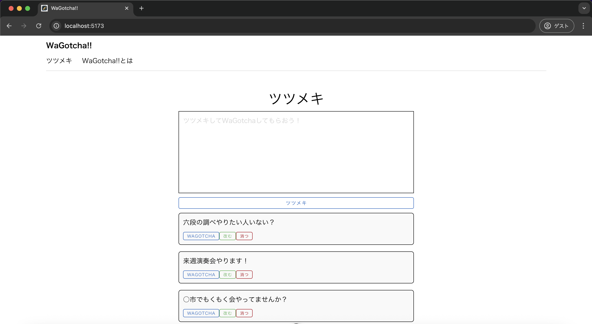
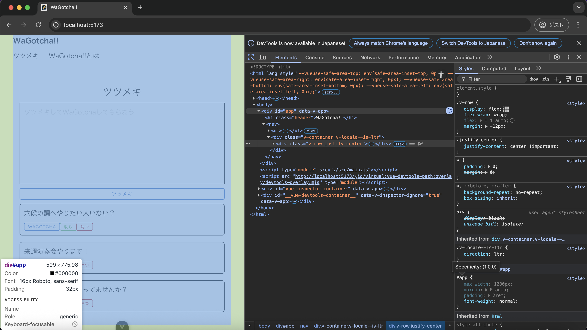

# 単体テスト仕様書
## 実施項目
| No   | 画面 | テスト処理 | 前提条件 | 操作手順 | 期待結果 | 実施結果 |
| --- | ----------- | ------- | ------- | ------- | ------- | ------- |
| 13 | 一覧画面 | レスポンシブ対応 | なし | 画面の横幅を599pxにすること | h1の文字列「ツツメキ」の表示が小さくなること |OK|

## tsutsumeki.js
```javascript
import { ref } from 'vue'

export const tsutsumekis = ref([
    {id:1, tsutsumeki: "六段の調べやりたい人いない？"},
    {id:2, tsutsumeki: "来週演奏会やります！"},
    {id:3, tsutsumeki: "○市でもくもく会やってませんか？"}
])
```
## テスト実施
### アプリケーション立ち上げ
```
npm run dev
```


### 実施結果
