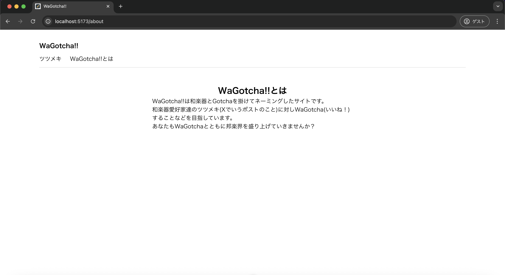
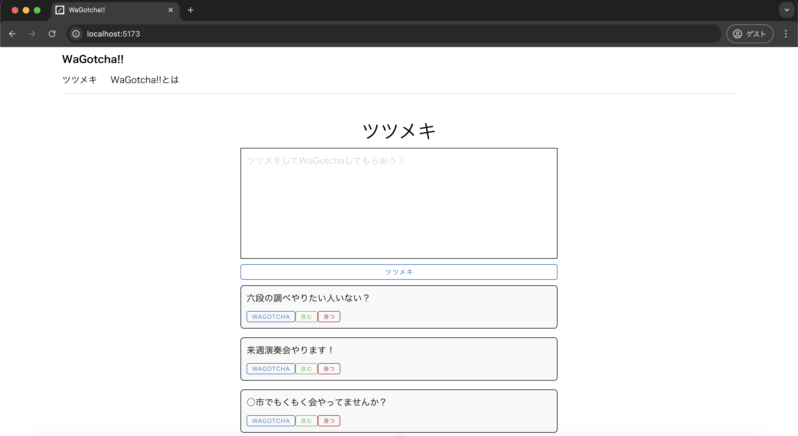

# 単体テスト仕様書
## 実施項目
| No   | 画面 | テスト処理 | 前提条件 | 操作手順 | 期待結果 | 実施結果 |
| --- | ----------- | ------- | ------- | ------- | ------- | ------- |
| 14 | 一覧画面 | コンポーネント切り替え | 画面のh1が「ツツメキ」になっている | 画面上部の「WaGotcha!!とは」を押下 | 「WaGotcha!!とは」のコンポーネントに切り替わること |OK|
| 15 | 一覧画面 | コンポーネント切り替え | 画面のh1が「WaGotcha!!とは」になっている | 画面上部の「ツツメキ」を押下 | 「ツツメキ」のコンポーネントに切り替わること |OK|

## tsutsumeki.js
```javascript
import { ref } from 'vue'

export const tsutsumekis = ref([
    {id:1, tsutsumeki: "六段の調べやりたい人いない？"},
    {id:2, tsutsumeki: "来週演奏会やります！"},
    {id:3, tsutsumeki: "○市でもくもく会やってませんか？"}
])
```
## テスト実施
### アプリケーション立ち上げ
```
npm run dev
```


### 画面上部の「WaGotcha!!とは」を押下


### 画面上部の「ツツメキ」を押下
