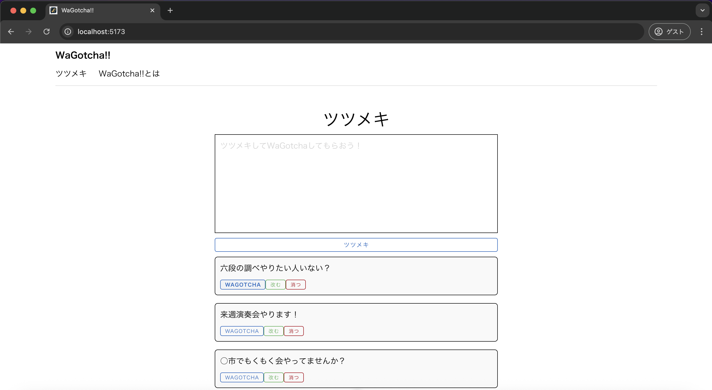

# 単体テスト仕様書
## 実施項目
| No   | 画面 | テスト処理 | 前提条件 | 操作手順 | 期待結果 | 実施結果 |
| --- | ----------- | ------- | ------- | ------- | ------- | ------- |
| 2 | 一覧画面 | ボタン表示 | tsutsumeki.jsにインポートできるデータが存在する | 「WAGOTCHA」ボタンを押下 | 押下したボタンが太字になること |OK|
## 表示されている画面

## tsutsumeki.js
```javascript
import { ref } from 'vue'

export const tsutsumekis = ref([
    {id:1, tsutsumeki: "六段の調べやりたい人いない？"},
    {id:2, tsutsumeki: "来週演奏会やります！"},
    {id:3, tsutsumeki: "○市でもくもく会やってませんか？"}
])
```
## テスト実施
### 「WAGOTCHA」ボタンを押下後
"六段の調べやりたい人いない？"のボタンを押下


