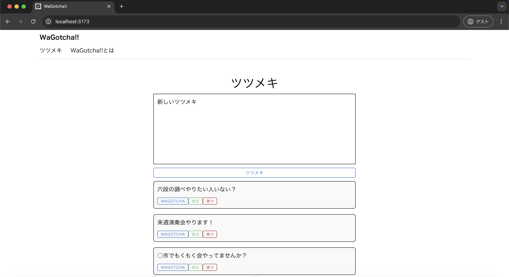

# 単体テスト仕様書
## 実施項目
| No   | 画面 | テスト処理 | 前提条件 | 操作手順 | 期待結果 | 実施結果 |
| --- | ----------- | ------- | ------- | ------- | ------- | ------- |
| 3 | 一覧画面 | 追加処理 | なし | テキストエリアに適当な文章を入力し、「ツツメキ」ボタンを押下」 | 入力した文章が新たに一覧として追加されていること |OK|
## 表示されている画面

## テスト実施
### 適当な文章を入力し、「ツツメキ」ボタンを押下

