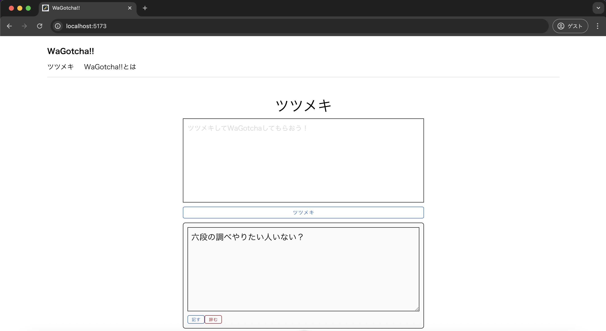
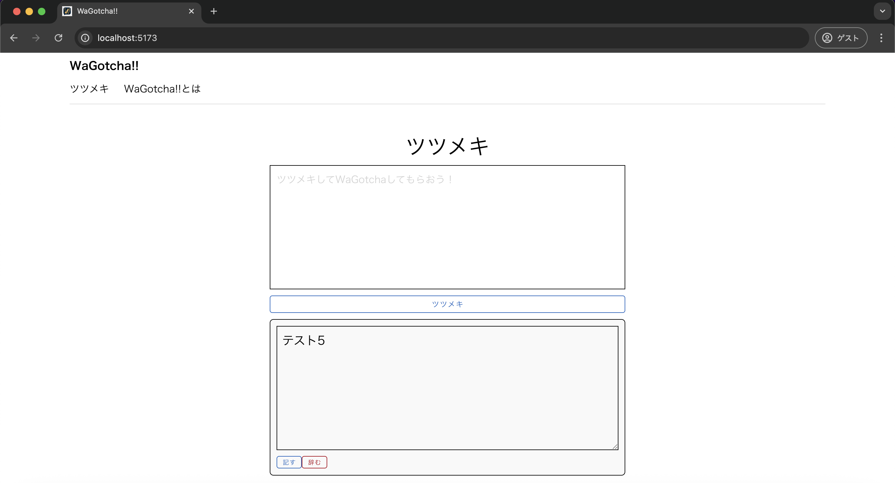
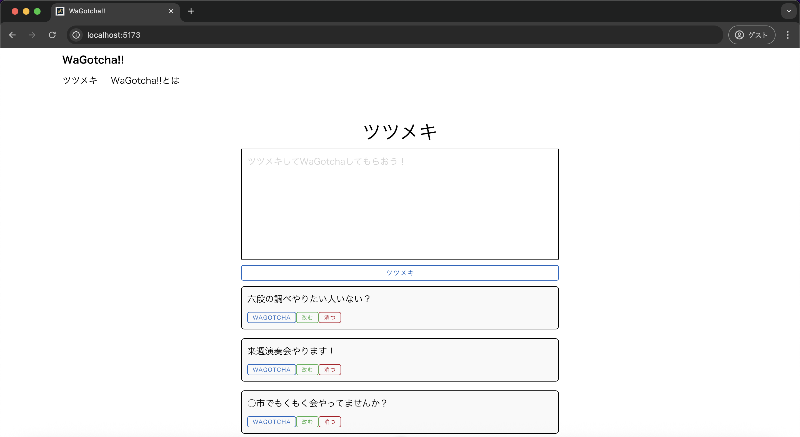

# 単体テスト仕様書
## 実施項目
| No   | 画面 | テスト処理 | 前提条件 | 操作手順 | 期待結果 | 実施結果 |
| --- | ----------- | ------- | ------- | ------- | ------- | ------- |
| 5 | 一覧画面 | 更新処理 | tsutsumeki.jsにインポートできるデータが存在する | 「改む」ボタンを押下し、文章を書き換えた上で「辞む」ボタンを押下 | 入力した文章が新たに一覧として更新されないこと |OK|
## 表示されている画面

## tsutsumeki.js
```javascript
import { ref } from 'vue'

export const tsutsumekis = ref([
    {id:1, tsutsumeki: "六段の調べやりたい人いない？"},
    {id:2, tsutsumeki: "来週演奏会やります！"},
    {id:3, tsutsumeki: "○市でもくもく会やってませんか？"}
])
```
## テスト実施
### "六段の調べやりたい人いない？"の「改む」ボタンを押下
投稿内容にある「改む」を押下後に表示されるボタンが「記す」「辞む」に切り替わっているのでNo.10もOK

### 適当な文章を入力し、「辞む」ボタンを押下

「辞む」を押下後に表示されるボタンが「WAGOTCHA」「改む」「消つ」に切り替わっているのでNo.12もOK
