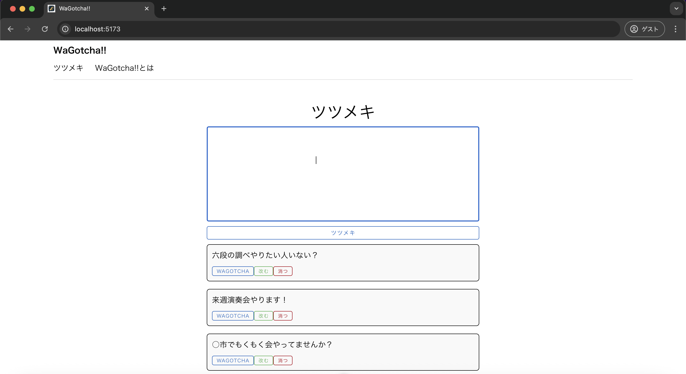
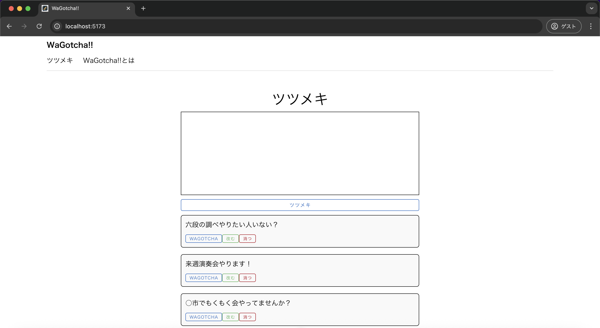

# 単体テスト仕様書
## 実施項目
| No   | 画面 | テスト処理 | 前提条件 | 操作手順 | 期待結果 | 実施結果 |
| --- | ----------- | ------- | ------- | ------- | ------- | ------- |
| 7 | 一覧画面 | バリデーション | なし | テキストエリアに空白文字や改行を入力し、「ツツメキ」ボタンを押下」 | 一覧に投稿が追加されないこと |OK|
## 表示されている画面

## テスト実施
### 空白文字や改行を入力し、「ツツメキ」ボタンを押下

