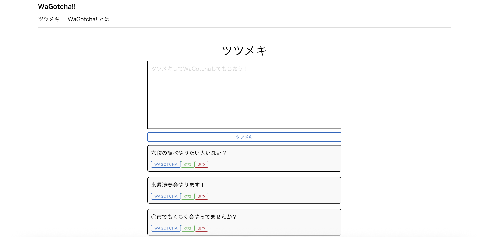
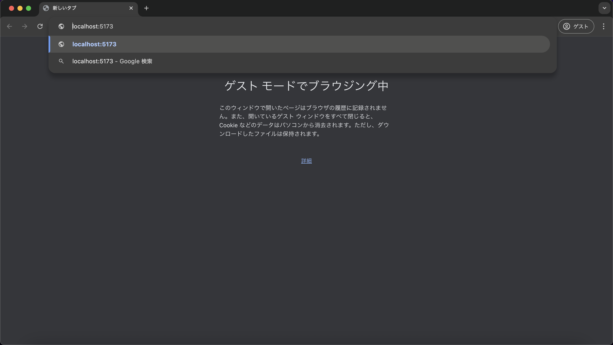

# 単体テスト仕様書
## 実施項目
| No   | 画面 | テスト処理 | 前提条件 | 操作手順 | 期待結果 | 実施結果 |
| --- | ----------- | ------- | ------- | ------- | ------- | ------- |
| 8 | 一覧画面 | データ取得 | tsutsumeki.jsの中身を空にする | アプリケーションを立ち上げlocalhost:5173を表示 | 一覧に投稿が表示されないこと |OK|

## 画面設計書の画像


## tsutsumeki.js
```javascript
import { ref } from 'vue'

export const tsutsumekis = ref([
])
```
## テスト実施
### アプリケーション立ち上げ
```
npm run dev
```

### 実施結果
